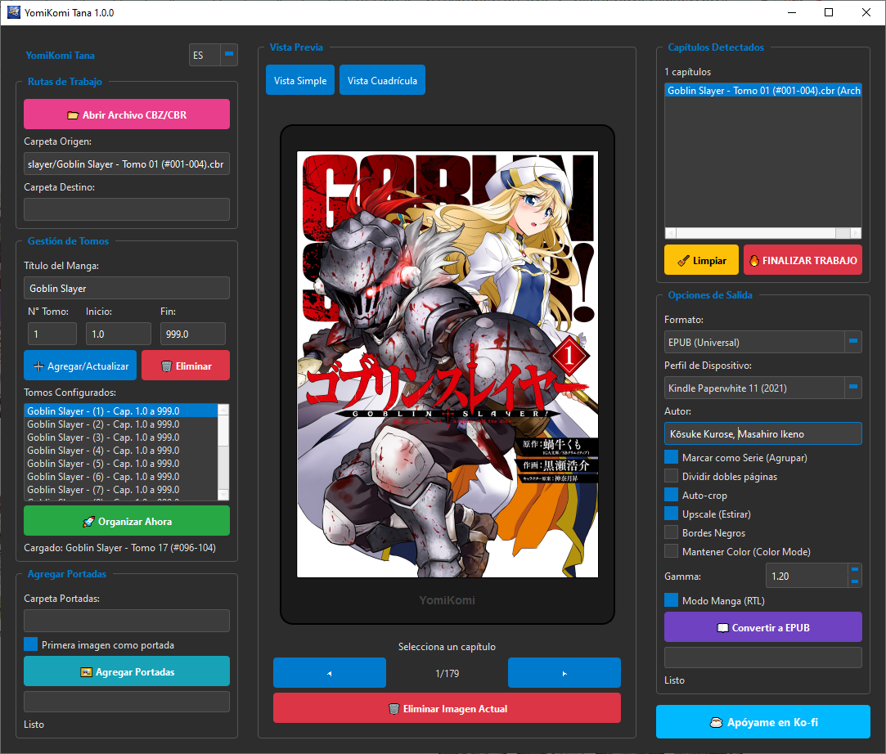

# YomiKomi Tana

YomiKomi Tana es una aplicacion de escritorio gratuita y 100% offline para convertir, recortar y organizar manga, comics y webtoons locales en formatos listos para e-readers y tablets.

[Descargar ultima version](https://github.com/Vict-or853/yomikomi-tana/releases) · [Reportar un bug](https://github.com/Vict-or853/yomikomi-tana/issues/new?template=bug_report.yml) · [Apoyar en Ko-fi](https://ko-fi.com/vict_or853)



## Funciones principales

| Funcion | Para que sirve |
| --- | --- |
| Auto-crop inteligente | Recorta margenes blancos o negros para aprovechar mejor la pantalla. |
| Division de paginas dobles | Separa escaneos horizontales en paginas verticales. |
| Modo webtoon | Convierte tiras largas en paginas individuales. |
| Modo manga RTL | Genera EPUB con lectura de derecha a izquierda. |
| Perfiles de dispositivo | Ajusta salida para Kindle, Kobo y tablets. |
| Procesamiento offline | Tus archivos se quedan en tu equipo. |

## Web del proyecto

La landing page vive en `index.html` y no necesita build. Para verla localmente, abre el archivo en tu navegador:

```powershell
start .\index.html
```

Si activas GitHub Pages con Actions, el workflow incluido en `.github/workflows/pages.yml` publica la web automaticamente desde la rama `main`.

## Descarga

1. Entra a [Releases](https://github.com/Vict-or853/yomikomi-tana/releases).
2. Descarga `YomiKomi_Setup.exe` de la version mas reciente.
3. Ejecuta el instalador en Windows 10 o Windows 11.

> Windows Defender puede mostrar una alerta de aplicacion desconocida en proyectos nuevos compilados con PyInstaller. El procesamiento de YomiKomi Tana es local.

## Formatos

Entradas compatibles: carpetas, `.zip`, `.rar`, `.cbz`, `.cbr`.

Salidas compatibles: `.epub`, `.cbz`.

## Desarrollo y Git

Este repo incluye una base para mantener el proyecto ordenado:

- `.gitignore` para builds, caches, archivos pesados y temporales.
- `.gitattributes` para finales de linea y binarios.
- Plantillas de issues y pull requests.
- `CHANGELOG.md` para documentar releases.
- `docs/git-workflow.md` con una convencion simple de ramas y commits.
- Workflow de GitHub Pages.

Consulta [docs/git-workflow.md](docs/git-workflow.md) antes de publicar cambios.

## Comunidad

Los reportes de bugs, ideas de funciones y mejoras de documentacion son bienvenidos. Usa las plantillas de GitHub para incluir sistema operativo, version de la app, pasos para reproducir y capturas cuando aplique.

## Licencia

El proyecto se distribuye como freeware. Si vas a aceptar contribuciones externas de codigo, conviene agregar un archivo de licencia formal antes de mezclar cambios grandes.
